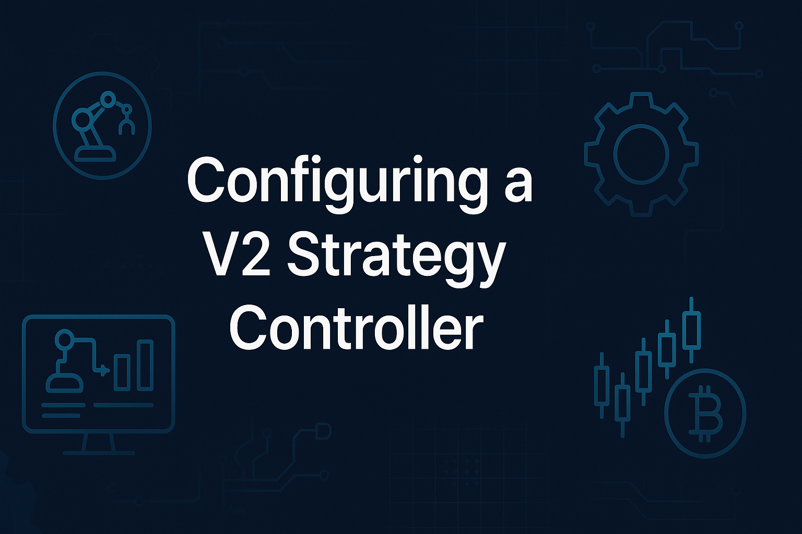

# How to Configure a V2 Strategy Controller in Hummingbot



## What are Controllers?

In Hummingbot’s new Strategy V2 framework, **Controllers** are tools that manage your trading strategies. They gather market data (such as price information and trading volumes) and use it to make trading decisions automatically.

Controllers allow you to handle multiple trading strategies or trading pairs without needing separate bots. This helps simplify management and saves resources.

<!-- more -->

[](../../../v2-strategies/diagrams/11.png)

## Example Scenario

Let's say you want to provide liquidity (buy and sell offers) for two different cryptocurrency trading pairs on Binance Futures. Each trading pair might need different settings, like order sizes, leverage, and buy/sell price spreads.

Previously, you'd need multiple bots for this. But with Hummingbot’s V2 Controllers, you can manage everything using just one script:

* Controller Script: [`pmm_simple.py`](https://github.com/hummingbot/hummingbot/blob/development/controllers/market_making/pmm_simple.py)
* Generic Execution Script: [`v2_with_controllers.py`](https://github.com/hummingbot/hummingbot/blob/development/scripts/v2_with_controllers.py)

## Step-by-Step Guide

### Step 1: Create Controller Configurations

[](../../../v2-strategies/diagrams/15.png)

To set up your controllers, run the following command:

```shell
create --controller-config market.making.pmm_simple
```

You will be asked for configuration details like:

* **Trading amount**: How much money you'll trade.
* **Connector**: The exchange you use (e.g., Binance).
* **Trading pair**: The specific cryptocurrency pair.
* **Spreads**: How far your orders are from the current market price.
* **Refresh Time**: How often the bot updates your orders.
* **Leverage**: Multiplier for your trading position (e.g., 20x leverage).
* **Stop Loss and Take Profit**: Limits to minimize losses and secure gains.

Below is the full prompt:

```shell

Enter the total amount in quote asset to use for trading: (e.g, 1000):  >>> 100
Enter the connector name (e.g., binance_perpetual):   >>> binance_perpetual
Enter the trading pair to trade on (e.g., WLD-USDT):  >>> WLD-USDT
Enter a comma-separated list of buy spreads: (e.g., '0.01, 0.02')   >>> 0.01, 0.02
Enter a comma-separated list of sell spreads: (e.g., '0.01, 0.02')  >>> 0.01, 0.02
Enter a comma-separated list of buy amounts as percentages (e.g., '50, 50'), or leave blank to distribute equally:  >>> 
Enter a comma-separated list of sell amounts as percentages (e.g., '50, 50'), or leave blank to distribute equally:   >>> 
Enter the refresh time in seconds for executors (e.g., 300 for 5 minutes):  >>> 20
Enter the cooldown time in seconds between replacing an executor that traded (e.g., 15):  >>>
Enter the leverage to use for trading (e.g., 20 for 20x leverage). Set it to 1 for spot trading:  >>> 20 
Enter the stop loss (as a decimal, e.g., 0.03 for 3%):  >>> 0.03
Enter the take profit loss (as a decimal, e.g., 0.02 for 2%):  >>> 0.02
Enter the time limit in seconds (e.g., 2700 for 45 minutes):  >>> 2700
Enter the order type for take profit (LIMIT/MARKET):  >>> OrderType.LIMIT
Enter the trailing stop as activation_price, trailing_delta (e.g., 0.0015,0.003):   >>> 0.013, 0.003
Enter the position rebalance threshold percentage  (e.g., 0.05 for 5%):   >>> 0.05
Enter a new file name for your configuration >> conf_market_making.pmm_simple_1.yml

```


Save your configurations with distinct names, such as:

* `conf_market_making.pmm_simple_1.yml`
* `conf_market_making.pmm_simple_2.yml`

These files will be located at:

```shell
/conf/controllers/
```

### Step 2: Create the Generic Script

[](../../../v2-strategies/diagrams/16.png)

Now, create a generic script to run both controller configurations simultaneously:

```shell
create --script-config v2_with_controllers
```

Enter your previously created configurations:

```shell
Controller configurations >>> conf_market_making.pmm_simple_1.yml, conf_market_making.pmm_simple_2.yml
Configuration filename >>> conf_v2_with_controllers_1.yml
```

!!! tip 
    After setup, it's easier to manually edit this configuration file directly rather than recreate it each time.

### Step 3: Launch Your Bot

Start your bot with the command:

```shell
start --script v2_with_controllers.py --conf conf_v2_with_controllers_1.yml
```

Check its status using:

```shell
status --live
```

[](../../../v2-strategies/diagrams/20.png)

## Making Dynamic Updates

One of the best features of Strategy V2 is that you can adjust your trading parameters while the bot is running. Simply edit your controller YAML files directly:

```shell
nano conf/controllers/conf_market_making.pmm_simple_1.yml
```

Example edits:

```yaml
connector_name: binance_perpetual
trading_pair: WLD-USDT
total_amount_quote: 100.0
buy_spreads:
  - 0.01
  - 0.02
sell_spreads:
  - 0.01
  - 0.02
leverage: 20
stop_loss: 0.03
take_profit: 0.02
```

After saving (`CTRL + O`) and exiting (`CTRL + X`), your bot automatically updates within a minute.

## Final Thoughts

Hummingbot's Strategy V2 Controllers make automated trading easier, more flexible, and efficient. Now you can run complex strategies effortlessly, managing multiple configurations with just one bot instance.